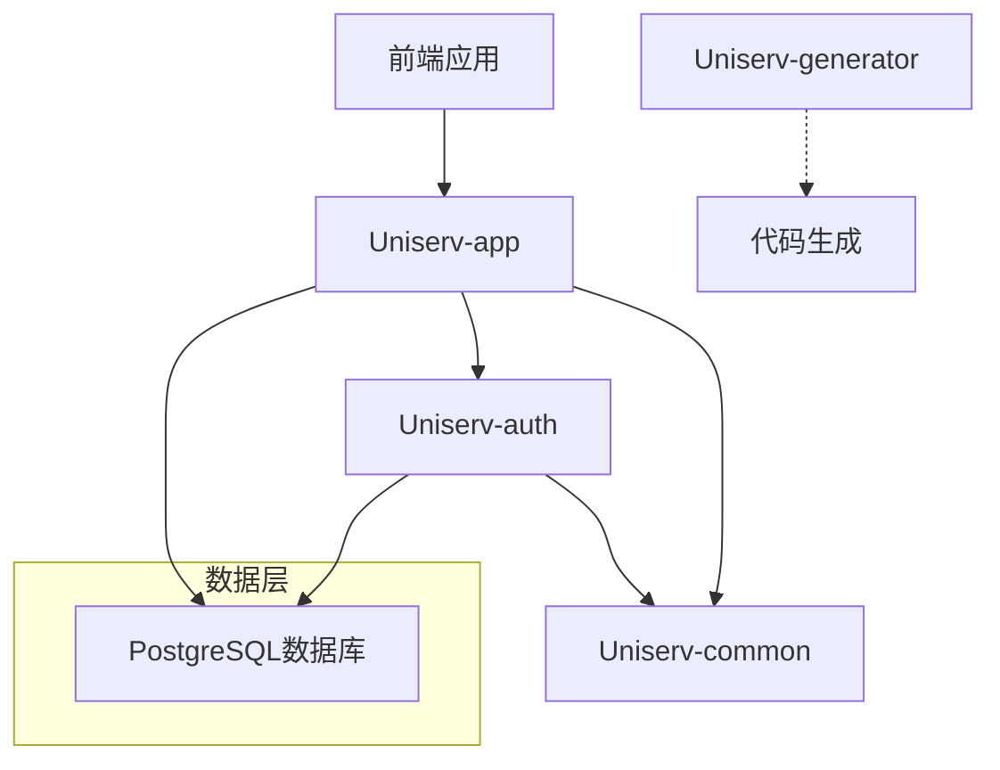

# 🏛️ Uniserv 统一服务系统

一个基于 Spring Boot 的综合性服务管理系统，采用模块化架构设计，提供用户认证、密码管理、账本管理等多种功能。

## 🚀 项目概述

Uniserv 是一个服务管理系统，旨在提供一套完整的解决方案，包括用户认证、密码管理、财务账本等功能。该项目采用了现代化的技术栈和最佳实践，确保系统的可扩展性、安全性和易维护性。

## 📚 模块导航

### 🔧 核心模块

- [📦 Uniserv-common](Uniserv-common/README.md) - 公共基础组件 ✅
- [🚀 Uniserv-app](Uniserv-app/README.md) - 应用启动模块 ✅
- [🔐 Uniserv-auth](Uniserv-auth/README.md) - 认证授权模块 ✅
- [🛠️ Uniserv-generator](Uniserv-generator/README.md) - 代码生成器 ✅

### 📝 业务模块

- [📝 Uniserv-flashnote](Uniserv-flashnote/README.md) - 闪记管理模块 🔄开发中

### 📖 文档资源

- [📘 API接口文档](docs/api/README.md)
- [🛠️ 开发文档](docs/development/README.md)

## 🚀 快速开始

### 环境要求

- JDK 25+
- PostgreSQL 13+
- Maven 3.9+

### 启动步骤

1. 配置数据库连接环境变量
2. 运行SQL脚本初始化数据库
3. 启动应用: `./mvnw spring-boot:run`

### 环境变量配置

```bash
export DB_URL=jdbc:postgresql://localhost:5432/uniserv
export DB_USER=your_username
export DB_PASSWORD=your_password
```

## 🔧 技术栈

### 后端框架

- **Spring Boot** 3.5 - 核心应用框架
- **MyBatis-Plus** 3.5 - ORM框架
- **PostgreSQL** - 主数据库
- **Sa-Token** 1.44.0 - 权限认证框架
- **SpringDoc** 2.8.15 - API文档

### 工具组件

- **Lombok** - 代码简化工具
- **Hutool** 5.8.40 - Java工具库
- **BCrypt** - 密码加密
- **Freemarker** 2.3 - 模板引擎

## 📊 系统架构



## 🎯 功能特性

### ✅ 已实现功能

- 用户注册/登录/登出
- 基于角色的权限控制
- 管理员用户管理(分页查询)
- RESTful API设计
- Swagger API文档
- 全局异常处理
- 日志链路追踪
- 代码生成工具

### 🔄 开发中功能

- 闪记管理模块
- 密码管理模块
- 账本管理模块
- 多因素认证
- OAuth2集成

## 📈 项目状态

- **开发阶段**: Alpha版本
- **代码质量**: 通过基础测试
- **文档完善度**: 80%
- **测试覆盖率**: 基础功能覆盖