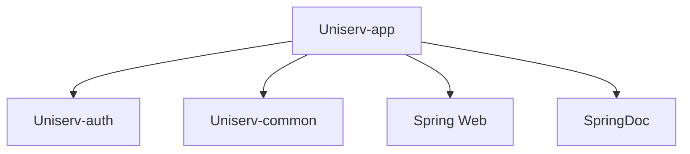

# 🚀 Uniserv-app

## 📋 模块概述

应用启动模块，负责整合所有业务模块并提供Web服务入口。

## ✅ 已完成功能

- [x] Spring Boot应用启动配置
- [x] Sa-Token权限拦截器配置
- [x] Swagger API文档配置
- [x] TraceId日志追踪配置
- [x] 全局异常处理机制
- [x] 认证接口控制器 (`AuthController`)
- [x] 管理员接口控制器 (`AdminUserController`)
- [x] 多环境配置支持 (dev/prod)

## 🔄 待完成功能

- [ ] 健康检查接口完善
- [ ] 监控指标配置
- [ ] 多语言支持
- [ ] 文件上传下载服务
- [ ] 消息队列集成

## 🛠️ 核心组件

### 配置类

- `SaTokenConfigure`: 权限拦截配置
- `SwaggerConfig`: API文档分组配置
- `TraceIdConfig`: 请求链路追踪配置

### 控制器层

- `AuthController`: 认证相关接口
- `AdminUserController`: 管理员用户管理接口

### 异常处理

- `GlobalExceptionHandler`: 全局异常统一处理

### 启动类

- `UniservApplication`: 应用启动入口

## 🔧 技术栈

- Spring Boot 3.5
- Spring Web MVC
- SpringDoc OpenAPI 3
- Sa-Token 1.44.0
- Validation API
- Actuator

## 📊 模块依赖



## ⚙️ 配置说明

### 环境配置

- `application.yml`: 主配置文件
- `application-dev.yml`: 开发环境配置
- `application-prod.yml`: 生产环境配置

### 关键配置项

```yaml
# 数据源配置
spring:
  datasource:
    driver-class-name: org.postgresql.Driver
    url: ${DB_URL}
    username: ${DB_USER}
    password: ${DB_PASSWORD}

# Sa-Token配置
sa-token:
  token-name: uniserv-token
  timeout: 604800  # 7天
  active-timeout: 172800  # 2天
```

## 📈 API文档

访问地址: `http://localhost:8080/swagger-ui.html`

### API分组

1. **认证模块**: `/api/auth/**`
2. **管理员模块**: `/api/admin/**`
3. **密码管理模块**: `/api/cipher/**`
4. **账本模块**: `/api/ledger/**`

## 🛡️ 安全配置

### 权限控制

- 免登录接口: `/api/auth/login`, `/api/auth/register`
- 需登录接口: 除免登录外的所有接口
- 管理员接口: `/api/admin/**` (需ADMIN角色)

### 拦截器配置

```java
// 全局登录验证
StpUtil.checkLogin()

// 管理员角色验证  
StpUtil.

checkRole("ADMIN")
```

## 📊 监控与运维

### 健康检查

- 端点: `/actuator/health`
- 信息: `/actuator/info`

### 日志配置

- 支持彩色控制台输出
- 按日期和大小滚动的日志文件
- TraceId链路追踪
- 错误日志单独记录