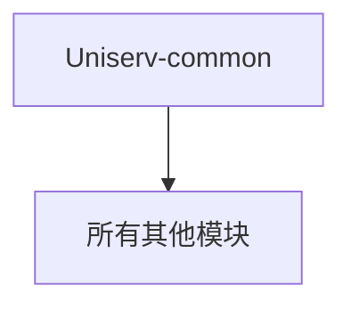

# 📦 Uniserv-common

## 📋 模块概述

公共基础模块，提供系统级通用组件和服务，被其他所有模块依赖。

## ✅ 已完成功能

- [x] 统一结果返回封装 (`ResultUtils`)
- [x] 全局异常处理机制
- [x] 业务异常定义 (`BusinessException`)
- [x] 响应码枚举 (`ResultCode`)
- [x] 分页基础DTO (`PageRequestDto`, `PageResponseDto`)
- [x] MyBatis-Plus分页配置
- [x] PostgreSQL UUID类型处理器
- [x] TraceId日志追踪机制
- [x] 正则表达式常量定义
- [x] 日志常量定义

## 🔄 待完成功能

- [ ] 缓存工具类
- [ ] 通用工具方法集合
- [ ] 国际化支持
- [ ] 配置中心集成

## 🛠️ 核心组件

### 统一响应格式

```java
ResultUtils<T> {
    int code;      // 状态码
    String message; // 响应信息  
    T data;        // 响应数据
    Long timestamp; // 时间戳
}
```

### 分页支持

- `PageRequestDto`: 分页请求基础类
- `PageResponseDto`: 分页响应封装，支持MyBatis-Plus Page对象自动转换

### 异常处理

- 全局异常拦截器
- 业务异常统一处理
- 参数校验异常处理

### 数据库支持

- PostgreSQL UUID类型映射
- MyBatis-Plus分页插件配置
- 逻辑删除配置

## 🔧 技术栈

- Spring Boot 3.5
- MyBatis-Plus 3.5
- PostgreSQL Driver
- Lombok
- Hutool

## 📊 依赖关系

